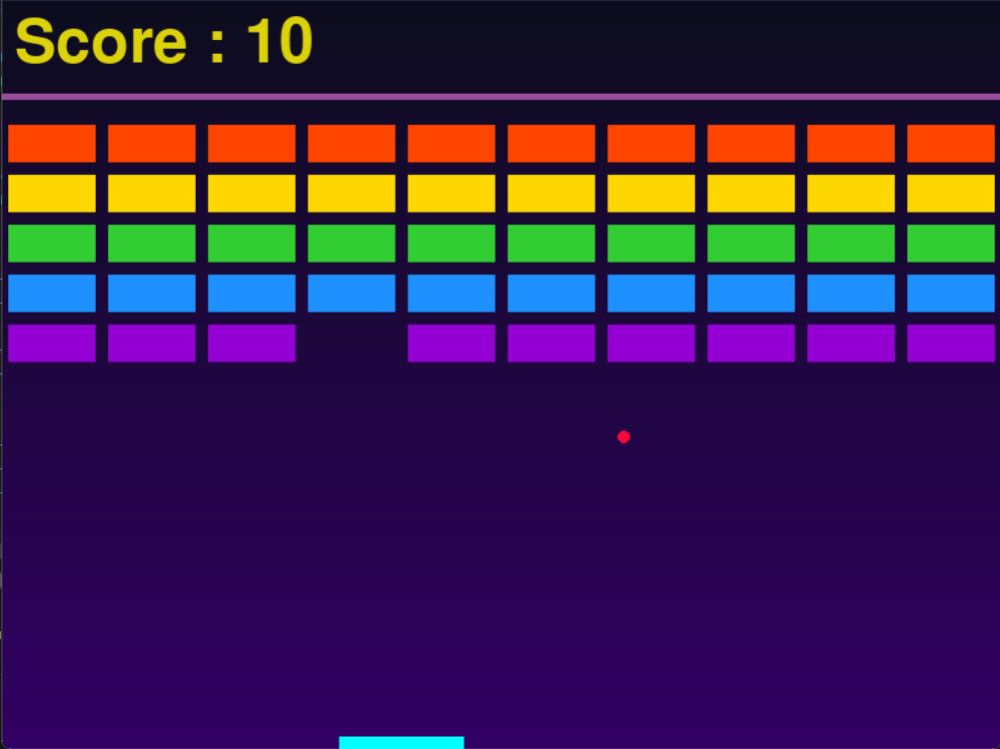
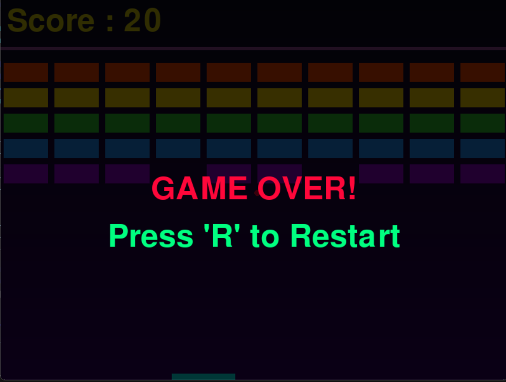
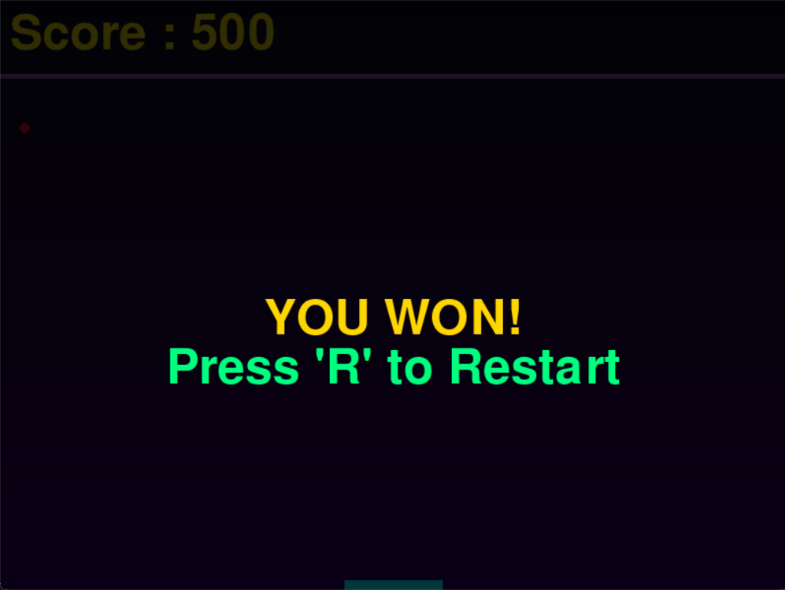

# Brick Breaker Game

Brick Breaker Game is a fun and engaging game where you control a platform to bounce a ball, breaking bricks to score points. This project is implemented in Python using the Pygame library.

## Table of Contents
- [Game Description](#game-description)
- [Features](#features)
- [How to Play](#how-to-play)
- [Controls](#controls)
- [Installation](#installation)
- [Screenshots](#screenshots)
- [Author](#author)

---

## Game Description
The game involves a ball that bounces around the screen. The goal is to destroy all bricks by hitting them with the ball while ensuring the ball does not fall below the screen. Use your platform to bounce the ball strategically and clear all levels.

---

## Features
- Gradient background for a visually pleasing interface.
- Five rows of bricks, each with unique neon colors.
- Realistic ball physics for dynamic gameplay.
- Background music and sound effects for collisions, victory, and game over.
- Pause functionality with restart option.

---

## How to Play
1. Launch the game.
2. Control the platform to bounce the ball towards the bricks.
3. Clear all the bricks to win.
4. Avoid letting the ball fall below the platform to prevent game over.

---

## Controls
- **Move Left**: `A`
- **Move Right**: `D`
- **Pause/Resume**: `P`
- **Restart Game**: `R` (after Game Over or Victory)

---

## Installation

1. **Clone the Repository**
   ```bash
   git clone https://github.com/your-repo/brick-breaker-game.git
   cd brick-breaker-game
   ```

2. **Install Dependencies**
   Ensure Python and Pygame are installed:
   ```bash
   pip install pygame
   ```

3. **Run the Game**
   ```bash
   python brick_breaker.py
   ```

---

## Screenshots





---

## Author

- **kurogamidesuu**
- GitHub: [kurogamidesuu](https://github.com/kurogamidesuu)

---

Happy Breaking! 🎮
